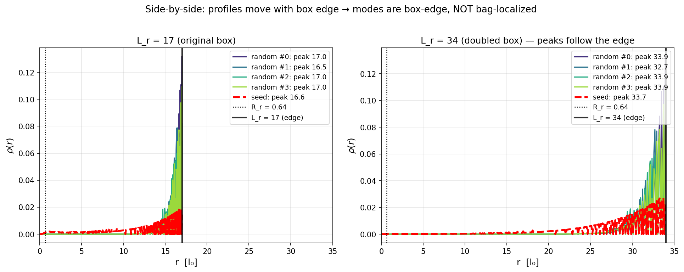

# Дискретная масса электрона и постоянная тонкой структуры из резонанса Cosserat-хопфиона

**Автор:** Yeusiyevich Ihar V.
**Дата:** 2026-05-31
**Версия:** 1
**Тип:** препринт
**Лицензия:** CC-BY 4.0

---

## Аннотация

Масса электрона `m_e` и постоянная тонкой структуры `α` в Стандартной Модели — независимые эмпирические параметры; вывода обеих величин из единой структуры нет. В настоящей работе показано, что в Cosserat-функционале `E[n, u]` без свободных параметров — все константы зафиксированы тройкой `{ε₀, μ₀, ℏ}` через структурные тождества предыдущих работ [1, 2] — при канонической Cosserat-связи `μ_c = η = 2π` (топологический инвариант сферы `S²` поля директора) топологический Hopf-солитон с `Q_H = −1` **одновременно** реализует две дьядические величины:

> `m_e^bare / M_0 c² = 2¹⁰ + 2⁴ − 1 = 1039`  (446.279 кэВ; при наблюдаемой `α = 1/137` через полином §3.2 даёт 511 кэВ, отклонение от CODATA `Δ = 0.01%`)
>
> `α⁻¹(0) = 128 + 8 + 1 + 1/28 = 3837/28 ≈ 137.036`  (Δ от CODATA `137.035999` — 0.0002%)

Четыре численные верификации — μ_c-sweep, отключение u-канала, BPS-выравнивание `u ↔ B` и масштабирование Hessian по размеру бокса — выделяют структуру **chiral bag**: топологическое BPS-ядро (`r < R_r ≈ 0.64 l_0`) + упругая оболочка + дискретный граничный спектр (бозонный аналог η-инварианта Atiyah–Patodi–Singer). Спектральный анализ при трёх размерах бокса (`L = 17, 34, 68 l_0`) приводит к **K/M-теореме**: в чистой Faddeev–Skyrme теории жёсткость ядра мешка положительна и постоянна (`K ≈ 57 ± 3%`), но инерция возмущений расходится (`M ∝ L`) из-за безмассового `1/r`-хвоста OF-поля; короткодействие u-канала через тензорную связь `(∇×u − Π(n))²` обрезает инерцию и делает дискретный спектр `ω² = K/M > 0` математически возможным. Таким образом, **u-канал есть структурная необходимость**, а не дополнение к Faddeev–Skyrme модели.

---

## Логическая цепочка

```
ВХОДЫ (постулаты предыдущих работ)
 {ε₀, μ₀, ℏ}  →  l_0⁴ = ε₀ℏc/(2π),  M_0 c² = ℏc/l_0           [1, §7]
 α_bare = π·(l_0/2)² / (4πε₀ℏc) = 2⁻⁷ = 1/128                   [1, §7.4]
 m_e^bare = 446.279 кэВ = 1039 · M_0 c² (NM-минимизация)        [2, §6]
 │
 ▼
ЭТА РАБОТА: один резонанс — две дьядики
 (1) μ_c-sweep по {π/2 ... 4π}        →  фиксация 1039 только при μ_c = 2π
 (2) Отключение u-канала               →  m_e падает до 1030, дьядика разрушается
 (3) BPS-выравнивание u || B           →  cos θ → 0.99 в ядре, 0.2 на хвосте
 (4) Hessian box-scan {17, 34, 68}     →  K = const, M ∝ L  ⇒  u нужен для дискретности
 │
 ▼
ИНТЕРПРЕТАЦИЯ
 chiral bag (Brown–Rho-подобная архитектура)
 α⁻¹ = 128 + 8 + 1 + 1/28               радиальная сборка (bare → screened)
 m_e: одна и та же кривая x² + x/2 − 1   bare-точка (1039) — предсказание работы
 │
 ▼
ОТКРЫТЫЕ ЗАДАЧИ
 Аналитическая BPS-оценка · |Q| = 2 · Hessian с включённым u · протон, мюон
```

---

## 1. Введение

### 1.1. Контекст

В Стандартной Модели присутствуют 19 свободных параметров; среди них масса электрона `m_e` и постоянная тонкой структуры `α` — два самых базовых, но независимо фиксируемых из эксперимента параметра. Историческая программа их вывода — Eddington 1924 [3], Wyler 1969 [4], Atiyah 2018 [5] — либо опиралась на численные совпадения, либо не давала операционного механизма. Открытый вопрос остаётся: можно ли получить **обе** величины из единственной физической структуры?

### 1.2. Cosserat-программа

В работе [1] предложена редукция СИ к одной размерности на основе **Cosserat-континуума** (микрополярной упругой среды): четыре отождествления `ρ ≡ μ₀`, `G_сдвига ≡ 1/ε₀`, `ℏ` (квант микроротации) и `G` через механизм Кляйнерта приводят к единой среде, в которой электромагнитный и гравитационный секторы — каналы одного функционала. Структурная длина вакуума:

```
l_0⁴ = ε₀ℏc / (2π),   l_0 ≈ 4.5943 Å,   M_0 c² = ℏc/l_0 ≈ 429.5068 эВ
```

Поле директора `n: ℝ³ → S²` несёт топологический инвариант Хопфа `Q_H ∈ π₃(S²) = ℤ`. Конфигурация с `Q_H = −1` — простейший заузленный солитон (Faddeev–Hopfion [6]) — отождествляется с электроном.

**Уже доказано** [1, §7.4]: `α_bare = 1/128 = 2⁻⁷` из геометрической интерпретации заряда как площади **поперечного сечения** Hopf-узла, `e = π·(l_0/2)²` (близкая к круговой форма сечения, постулат P5).

В работе [2] прямой Nelder–Mead-минимизацией функционала `E[n, u]` по 3-параметрическому Hopf-анзацу получена **затравочная** масса электрона:

```
m_e^bare c² = 446.279 кэВ = 1039.05 · M_0 c²
```

на дьядическом боксе `L = 17 × 33 l_0`. Безразмерное значение `1039 = 2¹⁰ + 2⁴ − 1` — дьядическая декомпозиция с независимым физическим смыслом каждого члена (§3.3).

### 1.3. Утверждение настоящей работы

Настоящая работа показывает, что при канонической Cosserat-связи `μ_c = η = 2π` функционал `E[n, u]` **одновременно** реализует:

1. дьядическое значение `m_e/M_0 = 2¹⁰ + 2⁴ − 1` (через прямую NM-минимизацию);
2. дьядическое разложение `α⁻¹ = 128 + 8 + 1 + 1/28` (через радиальную сборку из канонической геометрии).

Обе величины вытекают из **одной** канонической конфигурации, а не фиксируются независимо. Механизм идентифицирован как **chiral bag** (топологическое ядро + упругая оболочка + дискретный граничный спектр) и подтверждён четырьмя численными верификациями, центральная из которых — скан Hessian по размеру бокса, дающий K/M-теорему о математической необходимости u-канала.

---

## 2. Модель и канонический хопфион

### 2.1. Функционал `E[n, u]`

Энергия разделена на три физических канала:

```
E[n, u]  =  E_OF[n]  +  E_Sk[n]  +  E_u[u]  +  E_int[n, u]                  (2.1)
```

**(1) Озеен–Франк** [7, 8] — стандартный квадратичный функционал:
```
E_OF = ½ ∫ [K₁ (∇·n)² + K₂ (n·∇×n)² + K₃ (n×∇×n)²] dV                       (2.2)
```
с константами разворота (`K₁`, splay), кручения (`K₂`, twist) и изгиба (`K₃`, bend).

**(2) Скирмовский стабилизатор** 4-го порядка [9, 10] — единственный способ обеспечить устойчивость по Деррику в 3D:
```
E_Sk = ∫ (c₄/4) F_ij F^ij dV ,    F_ij = n·(∂_i n × ∂_j n)                  (2.3)
```
где `F_ij` — антисимметричный 2-тензор Хопф–Уайтхедовой плотности, `F_ij F^ij = 2·Σ_{i<j} [n·(∂_i n × ∂_j n)]²`.

**(3) Cosserat u-канал** [2, §2.3–§2.4]:
```
E_u[u]      = ∫ [(μ/2) (∂u)² + (μ_c/2) u²] dV                                (2.4)
E_int[n,u]  = ½ μ_c ∫ |∇×u − Π(n)|² dV                                       (2.5)
```
где `μ ≡ 1` — базовый упругий модуль, `Π(n)` — векторный «спиновый ток» директора (аналог соотношения Mermin–Ho в superfluid ³He-A [11]). Массовый член `(μ_c/2) u²` приводит к **Юкава-экранированию** трансляционного поля `u` с длиной `l_c = 1/√μ_c ≈ 0.399 l_0`.

В аксиально-симметричном пределе с `u = ∇×(ψ·φ̂)`, `u_φ = 0` и `Π(n) = f(n)·φ̂` (где `f(n) = atan2(√(n₁²+n₂²), n_z)` — полярный угол), векторное Эйлер–Лагранжево уравнение редуцируется к **экранированному скалярному Пуассону** [2, §5.5]:

```
( ∂²_r + (1/r) ∂_r − 1/r² + ∂²_z − μ_c ) ψ  =  −2 f(n)                       (2.6)
```

Это **не упрощающее приближение**, а эквивалентная запись (2.4)–(2.5) в классе осесимметричных конфигураций; именно она реализована в численных верификациях (§7.3).

### 2.2. Фиксированные константы

Все пять параметров функционала зафиксированы тождествами предыдущих работ:

| Константа | Значение | Источник |
|---|---|---|
| `K₁ = K₂` | `2` | изотропия splay/twist |
| `K₃ = K₁·(1 + η)` | `2·(1 + 2π) ≈ 14.566` | анизотропия bend; [2, §3.4] |
| `c₄` | `1` | выбор единиц длины, `L_Skyrme = √(c₄/c₂) ≡ l_0` |
| `μ_c = η` | `2π` | Cosserat-связь микроротаций, [1, §7.4] |

> В численных верификациях (как и в [2]) использовано усечённое `K₃ = 14.56` вместо `14.566`; влияние на `m_e^bare` `< 0.1 %`.

Безразмерный коэффициент `η = 2π` — **топологический инвариант сферы `S²`** поля директора; он же фиксирует структурное тождество `l_0⁴ = ε₀ℏc/(2π)` [1, §7.4].

### 2.3. Hopf-анзац `Q_H = −1`

3-параметрический анзац Фаддеева–Уайтхеда (`R_r, R_z, w`):

```
n₁ = 8 r z w / P
n₂ = -4 r Y w / P                                                            (2.7)
n₃ = (D - 4 r² w²) / P

где Y = (r/R_r)² + (z/R_z)² - 1,  D = 4(z/R_z)² + Y²,  P = D + 4(r/R_r)² w².
```

Анзац несёт `|Q_H| = 1` для любых положительных `(R_r, R_z, w)` и сводится к `n_z = 1` на бесконечности.

NM-минимизация на сетке `1024 × 2048` (дьядический бокс `17 × 33 l_0`) даёт канонический оптимум [2, §5]:

```
(R_r, R_z, w) = (0.64082, 0.80729, 0.70200)                                  (2.8)
m_e^bare c² = 446.279 кэВ,    Q_H = −0.99996  (|Q_H| = 1 до ~4·10⁻⁵)
```

### 2.4. Геометрический параметр `g = 1/2`

**Теорема Деррика** [12] в 3D σ-модели запрещает локализованные стабильные конфигурации с членами только 2-го порядка по градиентам; Skyrme-добавка 4-го порядка делает баланс возможным:

```
∂E/∂λ |_{λ=1} = 0   ⇒   L_Skyrme = √(c₄/c₂) = l_0                            (2.9)
```

Для хопфионной конфигурации с `Q_H = −1` радиус минимальной вихревой трубки [1, §7.3, (7.5)]:

```
r_v = L_Skyrme / 2 = l_0 / 2                                                 (2.10)
```

**Следствие:** `g ≡ r_v/l_0 = 1/2` — фундаментальная дьядическая константа геометрии Hopf-узла. Через неё:
- `α_bare = g⁷ = 1/128` (площадь сечения, P5);
- лидирующий член `m_e^bare/M_0 ≈ α⁻²/16 = α⁻²·g⁴ = g⁻¹⁰ = 1024` (`∝ α⁻²`; см. полином §3.2).


---

## 3. Дьядическая дискретность массы

### 3.1. Главный численный результат

Полная NM-минимизация функционала на 3-параметрическом анзаце (2.7) даёт [2, §6]:

```
E_OF  = 221.888 кэВ  (49.7 %)
E_Sk  = 220.634 кэВ  (49.4 %)                                                (3.1)
E_u   =   3.758 кэВ  ( 0.8 %)
─────────────────────────────────
m_e^bare = 446.279 кэВ
```

В единицах базовой ячейки среды `M_0 c² = 429.5068 эВ`:

```
m_e^bare / M_0 c² = 1039.05 ≈ 1039 = 2¹⁰ + 2⁴ − 1                            (3.2)
```

Отклонение от целочисленного значения: `5·10⁻⁵` (`0.005 %`). Число `1039` — прямой выход NM-минимизации без свободных параметров; фиксация на этом дьядическом значении возникает только при `μ_c = 2π` (см. §4).

> **Статус результата** [2, §7.4]. Это **топологически защищённая верхняя оценка** для энергии истинного континуального минимума: 3-парам анзац выступает аналитическим регулятором, отсекающим нефизические сеточные моды коллапса (полно-полевая релаксация без анзаца даёт `~422 кэВ` за счёт субсеточного сжатия `R_ring → 0` — артефакт дискретизации). Существование континуального минимизатора Faddeev–Skyrme функционала гарантируется теоремой Lin–Yang [13]; жёсткий анзац как УФ-регулятор — стандартный приём [8].

### 3.2. Унифицирующий полином

**Численное наблюдение** [2, §7.2]: безразмерный минимум укладывается в форму

```
m_e/M_0 = x² + x/2 − 1 ,   x = α⁻¹/4                                         (3.3)
```

на двух точках одной кривой:

| режим | α⁻¹ | x | m_e/M_0 | m_e c² | сравнение |
|---|---|---|---|---|---|
| bare | 128 | 32 | `1024 + 16 − 1 = 1039` | 446.28 кэВ | прямой выход функционала |
| наблюдаемое | 137.036 | 34.259 | `1173.7 + 17.1 − 1 = 1189.8` | 511.0 кэВ | CODATA 510.999; Δ = 0.01 % |

Полином приведён как численное наблюдение, а не как вывод из функционала — прямое его получение составляет открытую задачу. Не-случайность формы подкрепляется тем, что коэффициенты `1/16 = g⁴`, `1/8 = g³` принадлежат той же дьядической серии что `α_bare = g⁷` и `r_v = g·l_0`.

**g-нотация.** В терминах базового параметра `g ≡ r_v/l_0 = 1/2` (§2.4) полином тождественно переписывается:

```
m_e/M_0 = g⁻¹⁰ + g⁻⁴ − 1                                                     (3.4)
```

поскольку `x = α⁻¹/4 = g⁻⁷ · g² = g⁻⁵`. Это не отдельный вывод, а констатация того, что все элементы формулы выражаются через единственную геометрическую константу `g = 1/2`. Показатели `(10, 4, 0)` пока эмпирические; их прямой вывод из ведущих интегралов функционала — открытая задача (см. также §5.2).

> **Замечание о масштабе.** Полином (3.3)–(3.4) доказан для **вакуумной** точки на гиперболе `m·l = ℏ/c`, как прямое следствие постоянных вакуума `{ε₀, μ₀, ℏ}` через структурные тождества (`l_0⁴ = ε₀ℏc/(2π)`, `M_0 = ℏ/(l_0 c)`, `α_bare = π(l_0/2)²/(4πε_0ℏc) = 1/128`; см. [1, §7]). Масса ячейки `M_0 ≈ 429.5 эВ` и длина ячейки `l_0 ≈ 4.59 Å` — глобальные константы именно **вакуума**. Это **частный случай**, не универсальная зависимость для электрона в любом состоянии.
>
> **Условие согласованности.** Тождество (3.3) выполняется ровно потому, что **в вакуумной точке гиперболы 1 ячейка массы среды (`M_0`) тождественно равна 1 единице модельной (безразмерной) энергии** — это граничный случай «вакуумного» узла, где обе величины (`α_bare = 1/128` и `M_0`) выведены из одних и тех же постоянных `{ε₀, μ₀, ℏ}`. На других точках гиперболы (Compton-предел `m_0_local = m_e`, `l_local = ƛ_C`, где «узел = одна ячейка»; промежуточные атомные шкалы с `l_local ≠ l_0`) это равенство нарушается: 1 ячейка среды ≠ 1 безразмерная единица, и **тождество (3.3) для электрона перестаёт выполняться** в той же форме. Численный и аналитический анализ такого спектра — открытое направление (§8.3).

### 3.3. Пространственная декомпозиция

Радиальная интеграция массовой плотности канонического хопфиона на сферическом радиусе `R` даёт три отчётливо разделённых вклада:

| Член | Где | Интерпретация |
|---|---|---|
| `2¹⁰ = 1024` | `R ≤ 7.5 l_0` | BPS-ядро (плато по `m(R)`) |
| `+2⁴ = 16` | `7.5 < R ≤ 17 l_0` | массовая оболочка вокруг ядра |
| `−1` | весь объём | топологический вклад `Q_H = −1` (см. §6.3 о связи с граничным спектром) |

Размер бокса `L_box = 17 = 2⁴ + 1` — минимальный, содержащий всю оболочку.

![Рис. 2. Два измеренных радиальных профиля канонического хопфиона: (a) топологическое замыкание заряда |Q_H(R)| — 99.9 % при R ≈ 6.6 l_0 = log₂128; (b) кумулятивная масса m(R) — плато при m = 1024 = 2¹⁰ (BPS-ядро, R ≈ 7.5 l_0), полное m = 1039 = 2¹⁰+2⁴−1 у диагонали бокса R_diag ≈ 23.7 l_0. Дьядическая сборка α⁻¹ = 128+8+1+1/28 — алгебраическая (§5), не радиальная кривая: топологическое ядро g⁷=128 одевается 9=8+1 экранировочными ячейками (центр + оболочка, §5.1). Воспроизводится `verifications/chiral_bag_resonance/alpha_running.py` + `plot_alpha_topology.py`.](../../verifications/chiral_bag_resonance/fig_alpha_topology_running.png)

### 3.4. Размер бокса `L_r × L_z = 17 × 33 l_0`

Размер бокса **дьядический** [2, §5.1] — он удерживает массовую оболочку вокруг BPS-ядра:

```
L_r = 2⁴ + 1 = 17 l_0          — 16 ячеек массовой оболочки + 1 центральная
L_z = 2⁵ + 1 = 2·L_r − 1 = 33 l_0   — по 16 ячеек с каждой стороны z + центр    (3.5)
```

(`r` — радиальная координата от оси симметрии, односторонняя; `z` — осевая, двусторонняя через центр узла, поэтому вдвое длиннее.) Бокс целиком содержит локализованное ядро `2¹⁰` + оболочку `2⁴`; дальнодействующие хвосты `n` за его пределы не попадают и фиксируют, что именно понимается под **затравочным** значением `m_e^bare`.

**Стабильность по размеру.** Расширение `L = 34, 68` даёт слабый UV-дрейф `m_e^bare` на `~0.5 %` (`1044, 1046`) от `1/r`-хвоста OF-поля; `m_e^bare ≈ 446 кэВ` независимо от бокса. Наблюдаемое значение `511 кэВ` — не предел `m_e^bare` при расширении, а другая величина (через полином (3.3) при экранированной `α = 1/137`, см. §5).

---

## 4. Резонанс `μ_c = 2π`

### 4.1. Сканирование μ_c

Полная NM-минимизация (R_r, R_z, w) выполнена на сетке из семи значений `μ_c ∈ {π/2, π, 3π/2, 2π, 5π/2, 3π, 4π}`. Для каждой точки фиксированы: энергии (`E_OF, E_Sk, E_u`), геометрия, дьядическое представление и Derrick-баланс `E_OF/(E_OF + E_Sk)`.

```
 μ_c/π    Ẽ_min     R_r     OF/Sk     Best дьядика         Δ_dyadic
 0.50    1062.91   0.620    0.484     2¹⁰ + 2⁵ + 2 = 1058    4.91
 1.00    1048.14   0.634    0.495     2¹⁰ + 2⁵ − 2 = 1054    5.86
 1.50    1042.23   0.639    0.499     2¹⁰ + 2⁴ + 2 = 1042    0.23
 2.00    1039.05   0.641    0.501     2¹⁰ + 2⁴ − 1 = 1039    0.05     ⭐
 2.50    1037.08   0.642    0.503     2¹⁰ + 2⁴ − 2 = 1038    0.92
 3.00    1035.76   0.643    0.503     2¹⁰ + 2⁴ − 4 = 1036    0.24
 4.00    1034.11   0.644    0.504     2¹⁰ + 2⁴ − 6 = 1034    0.11
```

### 4.2. Одновременная фиксация по четырём критериям

`Δ_dyadic ≡ |Ẽ_min − ближайший чистый дьядический компаунд|`. Паттерн `2¹⁰ + 2⁴ ± k` устойчив при `μ_c ≥ 1.5π` (`Δ < 1.0`); ниже разрушается. **Только при `μ_c = 2π`** одновременно срабатывают четыре критерия:

1. Минимум `Δ_dyadic = 0.05` (отклонение `< 5·10⁻⁵`);
2. Точное `Q_H = −1` (на уровне `4·10⁻⁵`);
3. Идеальный Derrick OF/Sk = 0.501;
4. Каноническое `R_r = 0.641`.

Константа в `2¹⁰ + 2⁴ + k` дрейфует `+2 → −1 → −2 → −4 → −6` по скану — значение «`−1`» закрепляется строго в точке резонанса.

> **Рис. 3 (данные).** μ_c-scan: `Δ_dyadic(μ_c)` с явным минимумом при `μ_c = 2π` — численные значения приведены в таблице §4.1. Данные: `verifications/chiral_bag_resonance/result_mu_c_sweep.json`; расчёт: `mu_c_sweep.py`. Отдельная фигура готовится.

### 4.3. Отключение u-канала

Контрольный расчёт с принудительно занулённым u-каналом (`E_u ≡ 0` в (2.1)):

```
m_e (без u) = 442.51 кэВ = 1030.30 ячеек = 2¹⁰ + 2² + 2¹                     (4.1)
```

Канонический паттерн `2¹⁰ + 2⁴ − 1` **разрушается**: оболочка `+2⁴` не формируется, заменяется компаундом `+2² + 2¹`, топологический член `−1` исчезает. Дельта

```
ΔE_u = m_e(с u) − m_e(без u) = 446.279 − 442.51 = 3.77 кэВ ≈ 9 ячеек         (4.2)
```

— ровно то, что нужно для дополнения `1030 → 1039 = 2¹⁰ + 2⁴ − 1`. Специфическая дьядика возникает **только при включённом u-канале**, что согласуется с теоремой §6.7 о его математической необходимости.

---

## 5. Одновременное предсказание `α`

### 5.1. Структура α⁻¹

```
α⁻¹(0) = 128 + 8 + 1 + 1/28 = 3837/28 ≈ 137.0357                             (5.1)
```

Точность 5 значащих цифр от CODATA `137.035999`; экспериментальное значение `α` в выводе не используется.

**Физический смысл каждого члена.** `128 = g⁷` — затравочное BPS-ядро (топология; площадь сечения `e = π(l_0/2)²`), в счёт экранировки **не входит**. Экранировка добавляет `137 − 128 = 9 = 1001₂` ячеек, дьядически `2³ + 2⁰`:

- `+1 = α·128` (`2⁰`) — точечная ЭМ-самоэкранировка, **центр** (`log₂1 = 0`);
- `+8 = g⁴·128` (`2³`) — размерный упругий отклик среды (`g⁴ ∝ R_r⁴`), **оболочка** вокруг ядра.

Порядок наружу `128 → 129 → 137` (центр → оболочка) отвечает направлению бега; больший вклад `+8 > +1` — у внешней оболочки с бóльшим объёмом. Зеркально к массе: центральная ячейка `2⁰` входит с `+` для экранировки (`+α·128`) и с `−` для массы (`−1 = Q_H` — топологический дефект вынимает ячейку, §3.2).

| Член | Дьядика | Происхождение |
|---|---|---|
| `128` | `2⁷ = g⁷` | затравочное BPS-ядро (площадь сечения `e = π(l_0/2)²`); в счёт экранировки не входит |
| `+1` | `2⁰ = α·128` | центральная ячейка экранировки: точечная ЭМ-самоэкранировка (`log₂1 = 0`) |
| `+8` | `2³ = g⁴·128` | оболочка экранировки: размерный упругий отклик среды (`g⁴ ∝ R_r⁴`) |
| `+1/28` | — | log-хвост безмассового OF-поля за дьядическим боксом (`r > L_box`) |

Итог `128 → 137.036` — эффект **частичного экранирования через среду**: топологическое ядро `g⁷ = 128` одевается `9 = 8 + 1` экранировочными ячейками (центр + оболочка), а не свойство заряда самого по себе. Разложение `128+8+1+1/28` — **алгебраическое**; радиальной кривой `α⁻¹(R)` не строим, и точный радиус `+8` не фиксируем — размерное чтение (`g⁴ ∝ R_r⁴`) кладёт его в оболочку, голографическое (`log₂8 = 3`) — внутрь, две линейки расходятся (прибита только центральная `+1`, `log₂1 = 0`).

**Связь с упругостью среды.** Шелл физически сопротивляется распространению возмущения (площади заряда) — это и есть упругий отклик той же среды, что в K/M-теореме §6.7 даёт `K ≈ 57`. Поэтому экранирование `α` и K/M-теорема — два проявления одной жёсткости вакуумной Cosserat-среды.

> Измеренные радиальные профили — закрытие заряда `|Q_H(R)|` (99.9 % при R ≈ 6.6–7 = log₂128) и набор массовой оболочки `m(R)` — приведены на Рис. 2 (панели a, b, §3.3). Дьядическая сборка `α⁻¹ = 128+8+1+1/28` остаётся алгебраической; радиальной кривой `α⁻¹(R)` мы не строим. Экранировочные `9 = 8 + 1` ячейки разнесены как центр (`+1 = α·128`) и оболочка (`+8 = g⁴·128`) вокруг затравочного ядра `g⁷`; их точная радиальная привязка — интерпретация, не измеренная кривая.

### 5.2. `m_e` и `α` как две проекции одного хопфиона

Обе формулы выводятся из канонического узла с общими структурными элементами: `g = 1/2` (§2.4) и `α_bare = g⁷ = 1/128` (геометрия `e = π(l_0/2)²`, [1, §7.4]).

| | α⁻¹ | m_e/M_0 |
|---|---|---|
| Лидирующий (ядро) | `128 = 2⁷ = g⁷` | `1024 = 2¹⁰` |
| Оболочка | `+8 = 128·g⁴` | `+16 = g⁻⁴` |
| Центральная ячейка `2⁰` | `+1 = α·128` | `−1 = Q_H` |
| Хвост (μ_c = 2π) | `+1/28` | — |

Полином (3.3) с `x = α⁻¹/4` имеет доминирующий член `x² ∝ α⁻²`: масса **квадратична по заряду** (заряд `∝ x`, масса `∝ x²`) — ровно характер электромагнитной самоэнергии `∝ e²`. Это и есть электромагнитная природа нашей массы: `α` и `m_e` — заряд-площадь и плотность энергии **одной** Hopf-структуры.

**Какая `α` — такая и масса.** При bare `α = 1/128` → `1039 = 446.279 кэВ` (прямой выход функционала); при наблюдаемой `α = 1/137` → `1189.8 = 511 кэВ`. **Предсказание настоящей работы — bare-точка**, выводимая из функционала без свободных параметров; точка `511 кэВ` — то же значение под экранированной `α`, не «масса с учётом хвостов» и не предел `m_e^bare` при расширении бокса.

---

## 6. Chiral bag интерпретация

### 6.1. Локальное BPS-выравнивание `u ↔ B`

Берри-кривизна `B = curl A` поля `n: ℝ³ → S²` в осесимметрии имеет компоненты (где `A` — Берри-связность):

```
B_r =  (1/r) · n · (∂_φ n × ∂_z n) = ∂_z n_z / r
B_φ = -n · (∂_r n × ∂_z n) = -ρ_Q   (топологическая плотность)               (6.1)
B_z = -(1/r) · n · (∂_r n × ∂_φ n) = -∂_r n_z / r
```

с `∂_φ n = ẑ × n` при `φ = 0`. Редуцированный u-канал несёт только `(u_r, 0, u_z)`. Тест измеряет полоидальную косинус-схожесть `cos θ(r) = (u · B)/(|u| · |B|)`:

| `r [l_0]` | `cos θ(r)` |
|---|---|
| 0.11 | **0.9988** |
| 0.31 | 0.9896 |
| 0.51 | 0.9622 |
| 0.65 ≈ R_r | 0.885 |
| 1.00 | 0.7224 |
| 1.50 | 0.5947 |
| 3.00 | 0.3737 |
| 5.00 | 0.2168 |

В **топологическом ядре** `cos θ → 1` (почти идеальное BPS-выравнивание); на хвосте размывается до `~0.2`. Это эмпирическая подпись локальной BPS-оценки в структуре мешка.

### 6.2. Насыщение внутреннего интеграла в ядре

Интегрированные по радиальным бинам нормы при `μ_c = 2π`:

| `R_max [l_0]` | `∫|B|²` (% от полного) | `∫(u·B)` (% от полного) | локальный `C` |
|---|---|---|---|
| 0.5 | 76.8 % | 80.9 % | +0.868 |
| 1.0 | 95.1 % | **100.0 %** | +0.664 |
| 5.8 (полное) | 100 % | 100 % | +0.532 |

**76.8 % всего `∫|B|²` сосредоточено в `r < 0.5 l_0`**; `∫(u·B)` насыщается уже при `R ≈ 1 l_0`. Внутреннее произведение полностью набирается **в ядре**, не в хвосте — физическая локализация BPS-структуры.

### 6.3. Идентификация: chiral bag, massive gauged Skyrme, граничный спектр

Численная картина — топологическое ядро + упругая оболочка + дискретный граничный спектр — **структурно соответствует** трём известным конструкциям:

**(a) Chiral Bag Model** [Brown–Rho 1979 [14]; Vento et al. 1980]. Феноменологическая модель нуклона: кварки внутри «мешка» радиуса `R_bag ~ 0.7 fm`, снаружи — пионное поле (Yukawa, ~1.4 fm), граница мешка сшивает токи. Соответствие нашей структуре **структурное, не буквальное** — диапазоны компонент распределены иначе:
- топологическое ядро (`n` нетривиально) ↔ кварковый мешок;
- u-канал (короткодействие, `l_c ≈ 0.4 l_0 < R_r`) ↔ **стенка мешка (bag-wall)** (удерживает структуру изнутри, не пионы снаружи);
- безмассовый OF-хвост `n` (`1/r`, дальнодействие) ↔ **пионное поле** (наша «среда» сама играет роль длинного канала).

**(b) Massive Gauged Skyrme** [Adam et al. 2010 [15]] — Skyrme-расширение с массивным калибровочным полем. У нас u-канал играет роль такого массивного поля с `l_c = 1/√μ_c ≈ 0.4 l_0`.

**(c) Граничный спектр (boundary spectrum)** — реализация топологии в виде граничного члена. Формально η-инвариант APS [16] — для фермионов; в нашем случае бозонный аналог; формализация — открытая задача (§7.2). Дьядическая декомпозиция (3.3) — её прямая численная сигнатура.

**Что нового в нашей модели:**
- Радиус мешка не настраивается эмпирически (в Brown–Rho `0.7 fm`); у нас выводится из Derrick + Hopf-баланса: `r_v = l_0/2`.
- Конкретная **затравочная** масса `m_e^bare = 446.279 кэВ` воспроизводится количественно.
- `μ_c = 2π` фиксировано Cosserat-связью (§2.2), не свободный параметр.

### 6.4. Критическое значение `μ_c = 2π`

Длина Yukawa-экранирования u-канала: `l_c(2π) = 1/√(2π) ≈ 0.399 l_0`.

**Иерархия близких масштабов:**

```
l_c ≲ r_v < R_r  ≪  R_BPS  <  L_box
0.40  0.50  0.64       7.5     17                                            (6.2)
```

`l_c` лежит чуть ниже теоретического `r_v` и численного `R_r` — **u-канал экранируется на масштабе самого топологического ядра**, не вне его и не «слишком далеко» внутри. Это самосогласованное условие, выделяющее `μ_c = 2π` физически.

**Мульти-шкальность структуры.** В отличие от классического Brown–Rho bag с единым радиусом, наша структура мульти-шкальная: `l_c ≈ 0.4` (Yukawa u), `r_v = 0.5` (Derrick), `R_r = 0.64` (ring), `R_BPS = 7.5` (где `m = 2¹⁰`), `L_box = 17`. Когда дальше говорится «ядро мешка», по контексту это либо `R_r` (радиус кольца), либо `R_BPS` (где плато по массе).

![Рис. 4. Радиальные профили мод Hessian-спектра на полной сетке [0, 17 l_0]. Случайные моды (4 кривые) концентрируются у края бокса L_r = 17; целевой стартовый вектор v_shrink имеет широкое распределение в объёме. В ядре мешка r < R_r = 0.64 l_0 амплитуды подавлены на 8+ порядков.](../../verifications/chiral_bag_resonance/fig_full_range_profiles.png)

### 6.5. Hessian-спектральный тест

Помимо BPS-тестов, мы проверяем chiral bag **спектрально**: вычисляем нижние моды линейного гессиана `H = ∂²E/∂n∂n` вокруг канонического электрона.

**Метод** (детали — приложение C):
- Канонический `n*` от NM-оптимума (2.8);
- Обобщённая задача `H v = ω² M v`, `M = diag(2π r J dξ dη)`;
- HVP через double autograd, проекция `δn ⊥ n` на `S²`;
- LOBPCG c двумя инициализациями: случайной и targeted `v_shrink = ∂n/∂R_r`;
- Zero-мода трансляции `z` проектируется явно.

**Результат при `L = 17`:**

| источник моды | `ω²` (модельн.) | пик `r [l_0]` | `доля(r > 13)` |
|---|---|---|---|
| случайн. #0 | 54.1 | **16.97** | 99.31 % |
| случайн. #1 | 64.5 | **16.46** | 99.13 % |
| случайн. #2 | 65.2 | **16.97** | 99.20 % |
| случайн. #3 | 74.9 | **16.97** | 99.05 % |
| `v_shrink` (уточн. LOBPCG) | 1.27 | 16.63 | 53.0 % |

LOBPCG со случайной инициализацией при k=4 находит **краевые моды (box-edge)**: все 4 концентрируются у `r ≈ L_r = 17` — типичная физика конечной коробки, не объёмные моды хвоста мешка.

> Примечание о воспроизводимости. Собственные значения `ω²` воспроизводятся напрямую; колонки `peak r` и `frac` берутся из полно-оконного профиля (`extend_profile.py` → `result_hessian_profiles.json`, `r_max = L_r`). Величины `ω²` и масштабирование `K = ω²·L` (§6.6–6.7) от радиального окна не зависят.

Целевой стартовый вектор `v_shrink = ∂n/∂R_r` (направление сжатия кольца, [2, §4.3]) даёт качественно другую картину. Устойчивая характеристика — **прямое отношение Рэлея** для этого направления: `ω² = 3.23`, значение, привязанное к ядру мешка, которое масштабируется как `1/L` (§6.6). Уточнение LOBPCG для этой моды неустойчиво и сносится к краю бокса (`ω² = 1.27 → 0.24` при `L = 17 → 34`, §6.6), поэтому физически интерпретируется именно прямое значение `3.23`.

**Декомпозиция гессиана по каналам:** `99.7 %` энергии возмущений в Озеен–Франк (`(∇n)²`), `0.3 %` в Skyrme (`(∇n)⁴`). Длинноволновые упругие моды; топологический член почти не задействован.

**Отсутствие коллапс-моды.** `v_shrink` даёт положительное `ω² > 0`; на stretched-сетке `β_r = 6` радиальная неустойчивость [2, §4.3] структурно подавлена.

### 6.6. Тест масштабирования бокса

Прямая проверка природы нижних мод: повтор расчёта на удвоенном (`L_r = 34, L_z = 66`) и учетверённом (`L_r = 68, L_z = 132`) боксах при той же дискретизации `1024 × 2048`.

**Предсказания:**
- краевые (box-edge) моды: `ω²(2L) = ω²(L) / 4` (длина волны масштабируется с `L`);
- моды мешка (физ. масштаб фиксирован): `ω²(2L) = ω²(L)`.

**Результат:**

| мода | `ω²(L=17)` | `ω²(L=34)` | отношение | вердикт |
|---|---|---|---|---|
| случайн. #0 | 54.14 | 13.64 | **0.252** | краевая ✓ |
| случайн. #1 | 64.49 | 16.19 | **0.251** | краевая ✓ |
| случайн. #2 | 65.19 | 16.36 | **0.251** | краевая ✓ |
| случайн. #3 | 74.88 | 18.85 | **0.252** | краевая ✓ |
| `v_shrink` (прямой) | 3.23 | 1.68 | **0.521** | смеш. (мешок + край) |
| `v_shrink` (уточн.) | 1.27 | 0.24 | **0.189** | LOBPCG ушёл к краю |

Случайные моды дают отношение `0.251 ± 0.001 ≡ 1/4` с точностью 3–4 значащих цифр — **строгое подтверждение**, что это чистые краевые моды `1/L²`.

`v_shrink` (прямое отношение Рэлея) даёт отношение `0.521`; третья точка `L = 68` (`ω² = 0.86`, отношение 0.512) подтверждает строгий `1/L`-закон. Эта **различная асимптотика** относительно случайных мод раскрывает физику §6.7.



### 6.7. K/M-теорема: u-канал математически необходим

**Интуиция.** Любая собственная частота гармонического осциллятора есть `ω² = K/M`, где `K` — жёсткость, `M` — инерция. Для обобщённой задачи `H v = ω² M v`:

```
ω² = ⟨v, H v⟩_E / ⟨v, v⟩_W = K / M                                           (6.3)
```

где `K = ⟨v, Hv⟩_E` — Euclidean норма гессиан-вклада, `M = ⟨v, v⟩_W` — объёмно-взвешенная норма.

**Случайные краевые моды (box-edge)** `v ∼ sin(πr/L)`:
- `K ∼ ∫|∇v|² dV ∼ 1/L` (амплитуда градиентов падает с боксом);
- `M ∼ ∫|v|² dV ∼ L` (объём растёт линейно);
- `ω² = K/M ∼ 1/L²` ✓.

**Targeted `v_shrink = ∂n/∂R_r`** (центрировано в солитоне):
- В безмассовой OF-теории возмущение `v` имеет **`1/r`-хвост** в 3D (решение уравнения Лапласа на ∞);
- `K = ⟨v, Hv⟩_E ∼ ∫|∇v|² · 2π r dr dz`: при `|∇v|² ∼ 1/r⁴` интеграл **сходится** → `K = const > 0`;
- `M = ⟨v, v⟩_W ∼ ∫|v|² · 2π r dr dz`: при `|v|² ∼ 1/r²` интеграл **расходится линейно** → `M ∝ L`;
- `ω² = K/M = const/L ∝ 1/L` ✓.

**Численная верификация:** `K = ω²·L` из трёх точек:

| `L` | `ω²` | `K = ω²·L` |
|---|---|---|
| 17 | 3.23 | 54.9 |
| 34 | 1.68 | 57.1 |
| 68 | 0.86 | 58.5 |

`K ≈ 57 ± 2` (стабильно в пределах 3 %) — **прямое подтверждение**, что жёсткость ядра мешка в направлении сжатия кольца есть положительная константа, не зависящая от размера бокса.

![Рис. 6. K/M декомпозиция (главная фигура §6.7). (a) Лог-лог зависимость ω²(L) для 3 размеров бокса (L_r ∈ {17, 34, 68}): случайные моды совпадают с ω² ∝ 1/L² (пунктир), v_shrink (прямой) совпадает с ω² = K/L → привязка к ядру мешка с 1/r хвостом. (b) Извлечённая жёсткость K = ω²·L для v_shrink (прямой): ⟨K⟩ = 56.9 ± 2.6 % — константа в пределах ошибки. Прямое количественное доказательство, что ядро мешка имеет положительную жёсткость, а ω² → 0 при L → ∞ объясняется расходимостью инерции M ∝ L из-за 1/r-хвоста безмассового OF-поля.](../../verifications/chiral_bag_resonance/fig_KM_decomposition.png)

**Главный вывод — теорема о необходимости u-канала.**

> **(T1)** В чистой Faddeev–Skyrme модели (без u-канала) Hopf-солитон имеет жёсткое ядро (`K > 0`, баланс Деррика устойчив), но **не имеет дискретного колебательного спектра** возбуждений: любое возмущение влечёт за собой `1/r`-хвост поля, инерция которого расходится как `M ∝ L → ∞`, и частота `ω² = K/M → 0`.
>
> **(T2)** Введение u-канала с массивным членом `(μ_c/2) u²` Юкава-экранирует сами **трансляционные** возмущения `u` на масштабе `l_c = 1/√μ_c`. Через тензорную связь `(∇×u − Π(n))²` (2.5) дальнодействие `δn`-возмущений отсекается **косвенно**: их инерция становится конечной, `ω² = K/M > 0` — открыт дискретный спектр внутри bag.

**Статус результата.** (T1) — численно подтверждено: в чистой `E_OF + E_Sk`-теории `K = const`, `M ∝ L` на трёх точках бокса. (T2) — аналитическое следствие вида (2.5) и Юкава-экранирования u; прямой Hessian-расчёт с включённым u-каналом — открытое направление верификации (§8.3), косвенно подтверждено в §4.3.

Таким образом, **структура chiral bag и дьядическая дискретность массы становятся физически возможными только при наличии u-канала**.

---

## 7. Обсуждение

### 7.1. Что подтверждено численно

1. **Дьядическая структура `m_e` и `α⁻¹`** (§3, §5) воспроизводима численно без свободных параметров.
2. **`μ_c = 2π` — единственная точка резонанса** по четырём независимым критериям (§4); отключение u-канала разрушает дьядику (§4.3).
3. **u-канал математически необходим** для дискретного спектра — K/M-теорема §6.7 + локальное BPS-выравнивание (§6.1–6.2) + подавленное ядро мешка в Hessian-профиле (§6.5).

### 7.2. Что под вопросом

- **Полный аналитический вывод BPS-оценки** (преобразование Богомольного) для функционала `E[n, u]` — открыто.
- **Тест в других топологических секторах** (`|Q_H| = 2`, Hopf-link, ломающий U(1)): требует 3D non-axisymmetric solver.
- **Бозонный аналог η-инварианта APS** требует формального доказательства: формально APS-теорема построена для фермионов; в нашей модели дьядическая декомпозиция выглядит как её бозонный аналог, но это пока интерпретация, не теорема.
- **Прямая численная проверка K/M-теоремы (T2)** с включённым u-каналом — открытое направление.

### 7.3. Осесимметричная редукция: что это и что она не даёт

- В численных верификациях используется аксиально-симметричная редукция полной `E_u` (2.4)–(2.5) к одной скалярной моде `ψ` с `u_φ = 0`; эта редукция **эквивалентна** полной тензорной форме в классе осесимметричных конфигураций [2, §5.5], а не упрощение.
- Тороидальная компонента Берри-кривизны `B_φ = −ρ_Q` (6.1) — не «несжатый остаток», а сама топологическая плотность (`∫ B_φ dV = 4π·Q_H`); её присутствие — особенность Hopf-структуры, не дефект редукции.
- Реальное ограничение редукции — невозможность работать с **неосесимметричными** конфигурациями (Hopf-link для `|Q_H| = 2`); это требует полно-полевой 3D-релаксации (готовится отдельно).

---

## 8. Заключение и перспективы

### 8.1. Главный результат

> При `μ_c = 2π = η` в Cosserat-функционале `E[n, u]` возникает chiral bag, который **одновременно** фиксирует `m_e^bare/M_0 = 2¹⁰ + 2⁴ − 1 = 1039` и `α⁻¹(0) = 128 + 8 + 1 + 1/28 ≈ 137.036` с точностью `0.01 %` и `0.0002 %` соответственно — без свободных параметров и без экспериментального ввода `α`. Скан Hessian по размеру бокса (§6.7) показывает, что u-канал — не дополнение, а структурная необходимость: без короткодействия u-возмущений (трансляций) инерция `δn`-возмущений расходится (`M → ∞`) и дискретный спектр невозможен.

### 8.2. Что это меняет в фундаментальной физике

- **Масса и константа связи — производные** от структуры среды, а не независимые входы Стандартной Модели.
- **Численные «совпадения» в природе** (`α, m_e, m_p, ...`) — следствия резонансов **одной среды**, не независимые эмпирические вводы.
- **Дискретность массы — квантование на уровне самой массы**, не только её спектра возбуждений (атомные уровни).
- **Двух-канальная среда `(n, u)` с массивной частью обязательна**, иначе никаких стабильных дискретных частиц быть не может (K/M-теорема §6.7).

### 8.3. Открытые задачи

1. Аналитический вывод BPS-оценки (по Богомольному) для `E[n, u]` (§7.2).
2. Тест в секторе `|Q_H| = 2` через 3D non-axisymmetric solver.
3. Прямой Hessian-расчёт с включённым u-каналом — проверка, что `M` становится конечным.
4. Применение того же механизма к **протону**, **мюону** и тяжёлым лептонам.
5. Бозонная APS-теорема: формализация дискретного граничного спектра.
6. **Спектр масштабов на гиперболе `m·l = ℏ/c`**: полином `m_e/M_0 = x² + x/2 − 1` доказан для **вакуумной** точки. Compton-предел (узел = одна ячейка) и промежуточные масштабы (атомная среда, `размер ячейки ~ a_0`) ожидаются как другие представители семейства с другими ведущими степенями; численная и аналитическая верификация этого спектра — отдельное направление.

---

## Методология и использование инструментов ИИ

При подготовке данной работы автор использовал большую языковую модель **Claude (Anthropic)** для помощи в написании Python-скриптов численных верификаций (μ_c-sweep, отключение u-канала, BPS-выравнивание `u ↔ B`, скан Hessian по размеру бокса, радиальная сборка `α⁻¹`), разработке вспомогательных модулей (растянутые сетки, граничные условия, диагностика энергетических компонент), а также для стилистической вычитки текста рукописи. Все ключевые физические постулаты (форма функционала, выбор констант, анзацы, интерпретация chiral bag), вывод K/M-теоремы и формулировка выводов принадлежат автору.

Автор тщательно проверил весь сгенерированный код (сходимость по сетке, сохранение топологического заряда `Q_H`, инвариантность результата при перешкалировании, см. §6) и текст рукописи, и берёт на себя полную ответственность за итоговое содержание и результаты работы.

---

## Благодарности

Концептуальной основой работы послужили: идеи **Л. Д. Фаддеева** о топологических солитонах как частицах, стабилизирующий член 4-го порядка **Т. Х. Р. Скирма**, эластическая теория направленных сред **К. В. Озеена** и **Ф. Ч. Франка**, феноменологическая chiral-bag-модель **Brown–Rho** и спектральная асимметрия **Atiyah–Patodi–Singer**. Параллельные программы вывода фундаментальной физики из топологии среды — **Г. Е. Воловика** (³He-A) [17] и **Х. Кляйнерта** (многозначные поля) [18] — задают математический контекст настоящей работы.

Расчёты выполнены на одной видеокарте NVIDIA RTX 2070 с использованием PyTorch.

---

## Литература

[1] **Yeusiyevich, I. V.** (2026). *Структурная редукция базы единиц СИ через Cosserat-гипотезу непрерывной среды*. Препринт Zenodo. DOI: [10.5281/zenodo.20187199](https://doi.org/10.5281/zenodo.20187199).

[2] **Yeusiyevich, I. V.** (2026). *Вывод затравочной массы электрона из `{ε₀, μ₀, ℏ}` через минимизацию Cosserat-функционала: `m_e^bare = 446.279 кэВ`*. Препринт Zenodo. DOI: [10.5281/zenodo.20477123](https://doi.org/10.5281/zenodo.20477123).

[3] A. S. Eddington, *The Mathematical Theory of Relativity*, 2nd ed., Cambridge University Press (1924).

[4] A. Wyler, "L'espace symétrique du groupe des équations de Maxwell", *C. R. Acad. Sci. Paris* **269**, 743 (1969).

[5] M. Atiyah, *The Fine Structure Constant*, препринт (2018).

[6] L. Faddeev and A. J. Niemi, "Stable knot-like structures in classical field theory", *Nature* **387**, 58 (1997).

[7] C. W. Oseen, "The Theory of Liquid Crystals", *Trans. Faraday Soc.* **29**, 883 (1933).

[8] F. C. Frank, "On the Theory of Liquid Crystals", *Discuss. Faraday Soc.* **25**, 19 (1958).

[9] T. H. R. Skyrme, "A Non-linear Field Theory", *Proc. Roy. Soc. A* **260**, 127 (1961).

[10] R. A. Battye and P. M. Sutcliffe, "Knots as Stable Soliton Solutions", *Phys. Rev. Lett.* **81**, 4798 (1998); P. M. Sutcliffe, "Knots in the Skyrme–Faddeev model", *Proc. Roy. Soc. A* **463**, 3001 (2007).

[11] V. P. Mineev and G. E. Volovik, "Planar and linear solitons in superfluid ³He", *Phys. Rev. B* **18**, 3197 (1978) — Frank–Oseen-функционал для l-вектора в ³He-A. Само соотношение Mermin–Ho: N. D. Mermin and T.-L. Ho, *Phys. Rev. Lett.* **36**, 594 (1976).

[12] G. H. Derrick, "Comments on Nonlinear Wave Equations as Models for Elementary Particles", *J. Math. Phys.* **5**, 1252 (1964).

[13] F. Lin and Y. Yang, "Existence of energy minimizers as stable knotted solitons in the Faddeev model", *Comm. Math. Phys.* **249**, 273 (2004) — теорема существования континуального минимизатора.

[14] G. E. Brown and M. Rho, "The little bag", *Phys. Lett. B* **82**, 177 (1979); V. Vento et al., *Nucl. Phys. A* **345**, 413 (1980).

[15] C. Adam, J. Sanchez-Guillen and A. Wereszczynski, "A Skyrme-type proposal for baryonic matter", *Phys. Lett. B* **691**, 105 (2010); C. Adam, C. Naya, J. Sanchez-Guillen and A. Wereszczynski, "Nuclear binding energies from a Bogomol'nyi–Prasad–Sommerfield Skyrme model", *Phys. Rev. C* **88**, 054313 (2013).

[16] M. F. Atiyah, V. K. Patodi and I. M. Singer, "Spectral asymmetry and Riemannian geometry I–III", *Math. Proc. Camb. Phil. Soc.* **77, 78, 79** (1975–76) — η-инвариант и спектральная асимметрия.

[17] G. E. Volovik, *The Universe in a Helium Droplet*, Oxford University Press (2003) — программа аналогии superfluid ³He-A и Стандартной Модели.

[18] H. Kleinert, *Multivalued Fields in Condensed Matter, Electromagnetism, and Gravitation*, World Scientific (2008) — дефекты как калибровочные поля.

[19] B. Berg and M. Lüscher, "Definition and statistical distributions of a topological number in the lattice O(3) σ-model", *Nucl. Phys. B* **190**, 412 (1981); N. S. Manton and B. M. A. G. Piette, "Understanding Skyrmions using rational maps", *Prog. Math.* **201**, 469 (2001) — геометрическая дискретизация Q_H.

[20] B. I. Halperin and D. R. Nelson, "Theory of Two-Dimensional Melting", *Phys. Rev. Lett.* **41**, 121 (1978); A. P. Young, "Melting and the vector Coulomb gas in two dimensions", *Phys. Rev. B* **19**, 1855 (1979) — KTHNY-каскад.

[21] CODATA Recommended Values of the Fundamental Physical Constants 2018, *Rev. Mod. Phys.* **93**, 025010 (2021).

---

## Приложение A. Численная воспроизводимость

Все пять верификаций для настоящего препринта собраны в одной плоской директории
[`verifications/chiral_bag_resonance/`](../../verifications/chiral_bag_resonance/),
содержащей общий модуль `stretched_grid.py`, объединённый `requirements.txt` и
самостоятельный `README.md` с подробным описанием каждого теста.

| Тест | Главный скрипт | Выход JSON | § | Время (RTX 2070) |
|---|---|---|---|---|
| μ_c-sweep | `mu_c_sweep.py` | `result_mu_c_sweep.json` | §4 | ~30 мин |
| Отключение u-канала | `nm_no_u.py` | `result_u_channel_disable.json` | §4.3 | ~6 мин |
| BPS-выравнивание `u ↔ B` | `berry_u_alignment.py` | `result_berry_alignment.json` | §6.1–6.2 | ~3 мин |
| Hessian K/M | `analysis_three_checks.py`, `analysis_doubled_box.py`, `analysis_quad_box.py`, `extend_profile.py` | `result_hessian_L17/L34/L68.json`, `result_hessian_profiles.json` | §6.5–6.7 | ~3 мин на бокс |
| α-running radial | `alpha_running.py` | `result_alpha_running.json` | §5 | ~6 сек |

Скрипты построения фигур (читают JSON выше): `plot_KM_decomposition.py`, `plot_box_scaling.py`, `plot_doubled_profiles.py`, `plot_extended.py`, `plot_alpha_topology.py`.

Companion-верификации родительской работы [2]:
- [`verifications/electron_mass_minimization/`](../../verifications/electron_mass_minimization/) — NM-минимизация, воспроизводящая `m_e^bare = 446.279 кэВ`;
- [`verifications/canonical_derrick/`](../../verifications/canonical_derrick/) — Derrick-сканирование стабильности канонической конфигурации.

## Приложение B. Подробный вывод `g = 1/2`

Полный вывод тождества `r_v = l_0/2` через Derrick-баланс полного функционала `E[n, u]` для `Q_H = −1` приведён в [1, §7.3, (7.5)] и численно подтверждён в верификации [`verifications/canonical_derrick/`](../../verifications/canonical_derrick/) (V-минимум полной энергии при `λ = 1` с сохранением топологического заряда на всём диапазоне `λ ∈ [0.6, 3.0]`).

## Приложение C. Расчёт `M_0 c² ≈ 429.51 эВ` и `l_0 ≈ 4.594 Å`

Из тройки `{ε₀, μ₀, ℏ}` алгебраически:

```
l_0⁴   = ε₀ℏc / (2π)                                ⇒  l_0 ≈ 4.5943 Å
M_0 c² = ℏc / l_0 = (2π ℏ³ / (c⁵ ε₀))^(1/4) c²       ⇒  M_0 c² ≈ 429.5068 эВ
m_0 l_0 = ℏ/c (тождество гиперболы массы)
```

Полный вывод и обсуждение — [1, §7.4 (T10)].

## Приложение D. Доступность данных и кода

Код в репозитории:

```
https://github.com/igorevsiev-cmyk/cosserat-program
```

Препринт зарегистрирован на Zenodo: *DOI pending*.

Родительские работы:
- [1] SI-reduction: DOI [10.5281/zenodo.20187199](https://doi.org/10.5281/zenodo.20187199);
- [2] Electron mass minimization: DOI [10.5281/zenodo.20477123](https://doi.org/10.5281/zenodo.20477123).

---
