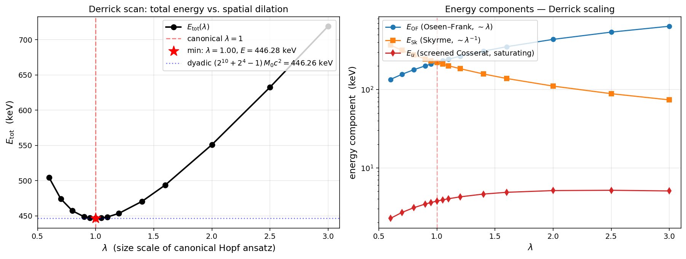

# Canonical Derrick verification

This folder provides a self-contained numerical verification that the canonical
Cosserat hopfion (the "electron configuration" in the paper) sits at a true
**Derrick minimum** of the bare energy functional `E[n, u]`, with the
gravitational channel (Cosserat coupling `μ_c`) included.

## What is verified

The paper claims the canonical configuration

```
K₁ = K₂ = 2,     K₃ = 14.56 = K₁·(1 + η),      η = 2π
c₄ = 1,                                          μ_c = 2π
3-param Hopf ansatz:  R_r = 0.64082,  R_z = 0.80729,  w = 0.70200
```

is the energy minimum on the Hopf submanifold (on the dyadic box
`L = 17 × 33`) and gives

```
m_e^bare = E_total · M₀c² = 446.279 keV          (bare electron mass)
```

The Derrick scan checks **stability under spatial dilation**: scale
`(R_r, R_z) → λ·(R_r, R_z)` for `λ ∈ [0.6, 3.0]` and evaluate every term
of the bare functional at each `λ`. A true minimum at `λ = 1` requires
the V-shape with the canonical point at the bottom; a false minimum
(or an open functional that decays to vacuum) would show a monotone
trend instead.

## Result



| λ    | E_OF (keV) | E_Sk (keV) | E_u (keV) | E_tot (keV) | Q          | Derrick |
|------|------------|------------|-----------|-------------|------------|---------|
| 0.60 | 134.13     | 367.72     | 2.26      | 504.11      | −0.999990  | −229.07 |
| 0.70 | 156.19     | 315.19     | 2.70      | 474.08      | −0.999985  | −153.60 |
| 0.80 | 178.18     | 275.79     | 3.09      | 457.06      | −0.999977  |  −91.43 |
| 0.90 | 200.07     | 245.15     | 3.45      | 448.67      | −0.999968  |  −38.18 |
| 0.95 | 210.99     | 232.24     | 3.61      | 446.84      | −0.999962  |  −14.04 |
| **1.00** | **221.89** | **220.63** | **3.76** | **446.28** ← min | **−0.999956** | **+8.77** |
| 1.05 | 232.77     | 210.13     | 3.90      | 446.79      | −0.999949  |  +30.44 |
| 1.10 | 243.62     | 200.57     | 4.03      | 448.22      | −0.999942  |  +51.10 |
| 1.20 | 265.27     | 183.86     | 4.26      | 453.39      | −0.999924  |  +89.93 |
| 1.40 | 308.31     | 157.59     | 4.62      | 470.53      | −0.999880  | +159.96 |
| 1.60 | 351.02     | 137.89     | 4.87      | 493.78      | −0.999821  | +222.86 |
| 2.00 | 435.43     | 110.32     | 5.12      | 550.86      | −0.999651  | +335.35 |
| 2.50 | 539.01     |  88.25     | 5.16      | 632.43      | −0.999319  | +461.09 |
| 3.00 | 640.44     |  73.54     | 5.06      | 719.05      | −0.998826  | +577.02 |

Full data: `derrick_scan.csv`. Topological charge `Q ≈ −1` preserved across
the entire range (`|Q + 1| < 1.2·10⁻³` even at extreme λ = 3.0).

**Outcome.** `λ = 1.00` is the discrete minimum (V-shape confirmed),
delta from neighbours: `+0.565 keV` vs `λ = 0.95` and `+0.510 keV` vs
`λ = 1.05`. The canonical 3-parameter ansatz on the dyadic box is therefore
at Derrick balance to the resolution of the scan.

### Empirical Derrick scalings

The two leading energy components follow the expected scaling laws
under `x → λx`:

| component | scaling | reason |
|-----------|---------|--------|
| `E_OF`    | `λ¹`    | quadratic gradients of `n` (`E_OF/λ ≈ 220 keV` across the scan) |
| `E_Sk`    | `λ⁻¹`   | quartic Faddeev–Skyrme term (`E_Sk·λ ≈ 220 keV` across the scan) |
| `E_u`     | sub-linear, **saturating** | screened Cosserat coupling: fixed screening length `l_c = 1/√μ_c` clips the u-field, so `E_u` grows slowly and levels off near `≈ 5 keV` rather than following `λ²` |

The screened `E_u` is small (`< 1 %` of `E_tot` near `λ = 1`) and does not
co-scale with the hopfion — the Cosserat screening length is an absolute
material constant. The Derrick balance is therefore set almost entirely by
the `E_OF`/`E_Sk` pair, whose crossover (`E_OF ≈ E_Sk ≈ 221 keV`) lands at
`λ = 1`.

The `Derrick` column printed by the script is the residual
`E_OF − E_Sk + 2·E_u` (`dE/dλ|_λ` under the canonical scalings); at
`λ = 1.0` it reads `+8.77 keV`. Because the screened `E_u` no longer scales
as `λ²`, this residual is only an approximate slope estimate — the
authoritative result is the discrete `argmin` of `E_tot`, which lies
exactly at `λ = 1.00`.

## How to reproduce

```bash
# environment
pip install -r requirements.txt

# run scan (~30 s on RTX 2070, longer on CPU)
python derrick_scan.py

# regenerate plot from CSV
python plot.py

# (optional) regenerate the hopfion visualization
python hopfion_visualize.py
```

Output: `derrick_scan.csv` (numerics) and `derrick_scan.png` (figure above).
The `hopfion_visualize.py` script generates `hopfion_visualize.png`
(four-panel visualization of the canonical Hopf field; pure
`numpy + matplotlib`, no PyTorch required).

## Files

- `derrick_scan.py` — main verification script (includes the `Config` class
  inline; the canonical numerical parameters are hard-coded at the top)
- `stretched_grid.py` — adaptive (sinh-stretched) grid utilities, full
  Cosserat energy (`compute_energy_cosserat_stretched`), topological charge
  (`compute_Q_stretched`), and the screened Cosserat solver
  (`compute_E_u_screened` — preconditioned conjugate gradient with Robin
  boundary condition for the `u`-channel at finite `μ_c`).  Uses
  **linear-extrapolation ghost cells in z** (not periodic) — periodic BC
  was the source of a previously observed bend-term divergence under grid
  refinement, fixed in the 2026-05-16 diagnostic session.
- `plot.py` — regenerates the Derrick-scan figure from `derrick_scan.csv`
  (matplotlib only)
- `hopfion_visualize.py` — approximate visualization of the canonical Hopf
  configuration (four panels: `n_z`, `|n_⊥|`, Hopf-charge density, schematic
  3D linked rings). Pure `numpy + matplotlib`, no PyTorch required
- `derrick_scan.csv` — pre-computed Derrick-scan results (14 λ-points)
- `derrick_scan.png` — pre-generated Derrick-scan figure
- `hopfion_visualize.png` — pre-generated hopfion visualization
- `requirements.txt`

## Setup details

- Grid: 1024 × 2048 axisymmetric (r, z), adaptive stretched with focus
  `r = R_hopf = 1`, `z = 0`, sharpness `β_r = 6`, `β_z = 3`,
  dyadic box `L_r = 17`, `L_z = 33` (in units of `l₀`;
  `L_r = log₂(2⁷·2¹⁰) = 17`, `L_z = 2·L_r − 1 = 33`).
- Optimizer: none — at each λ the energy of the canonical 3-parameter
  Hopf ansatz is evaluated directly (no relaxation needed since the canonical
  point is itself the relaxed configuration).
- u-channel: screened Cosserat solver (preconditioned conjugate gradient
  with Robin boundary condition, stopping tolerance `1e-8`, ~ 900 PCG
  iterations per λ).
- Float precision: `float64` throughout.
- The simulator units are natural Cosserat units (`l₀`, `M₀c²`); the
  conversion to keV uses

      M₀c² = (2π · ℏ³ / (c⁵ · ε₀))^(1/4) · c² / e ≈ 429.51 eV
      m_e^bare = E_total · M₀c² / 1000   [keV]

  All physical constants from CODATA 2018 (see top of `derrick_scan.py`).

## Relation to the NM verification

This script verifies that the canonical configuration is a **Derrick minimum**.
The companion verification at [`../electron_mass_minimization/`](../electron_mass_minimization/)
verifies that the same configuration is the **Nelder–Mead optimum** of the
full 3-parameter Hopf ansatz space.

Together the two verifications close the logical loop:

1. **Existence**: NM finds a minimum at `(R_r, R_z, w) ≈ (0.641, 0.807, 0.702)`
   with `m_e^bare ≈ 446.279 keV` (`../electron_mass_minimization/`).
2. **Stability**: that point is a true minimum under spatial dilation,
   not a saddle (this folder).

Both folders use the identical grid (`1024 × 2048`, dyadic box `17 × 33`)
and the identical screened `u`-channel solver, so the two `m_e^bare` values
agree exactly (`446.279 keV`).

## Scope of this verification

This artifact verifies the **Derrick balance** of the canonical point: a
true minimum under spatial dilation, with the `E_OF`/`E_Sk` pair crossing
at `λ = 1`. It does **not** independently reconstruct the canonical
parameters `(R_r, R_z, w)` — those come from the Nelder–Mead optimization
in the companion artifact (`../electron_mass_minimization/`). The Derrick
scan here closes the loop: given the canonical parameters, the bare
functional has its minimum at exactly that point.

The verification reproduces `m_e^bare = 446.279 keV` — the **bare** electron
mass in the Cosserat vacuum. This is the output of the bare functional as
such; it is deliberately not compared with the physical (dressed) electron
mass. The NM optimum matches the dyadic closed form
`(2¹⁰ + 2⁴ − 1)·M₀c² = 1039·M₀c²` to `0.005 %` (see
`../electron_mass_minimization/`).
